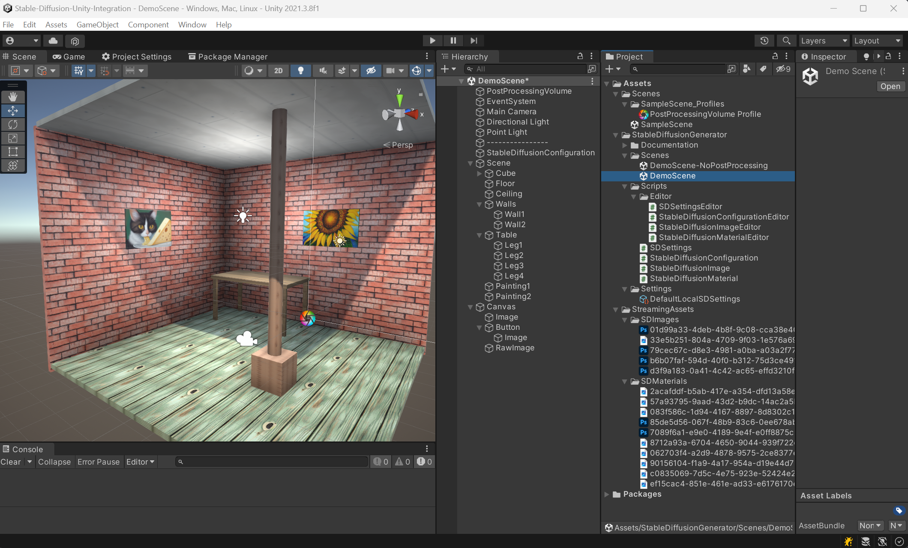
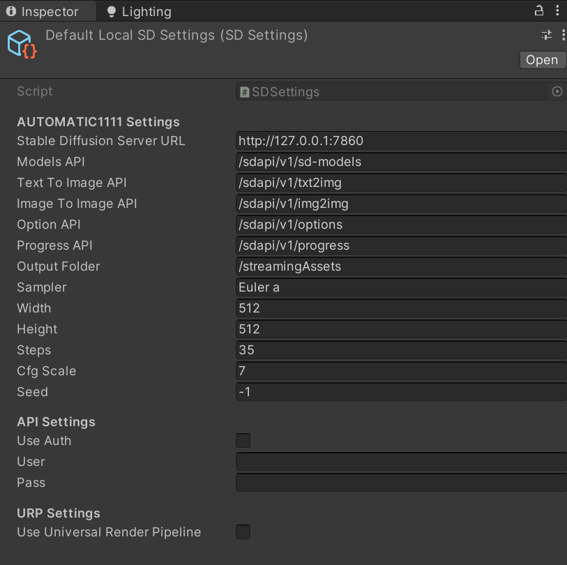
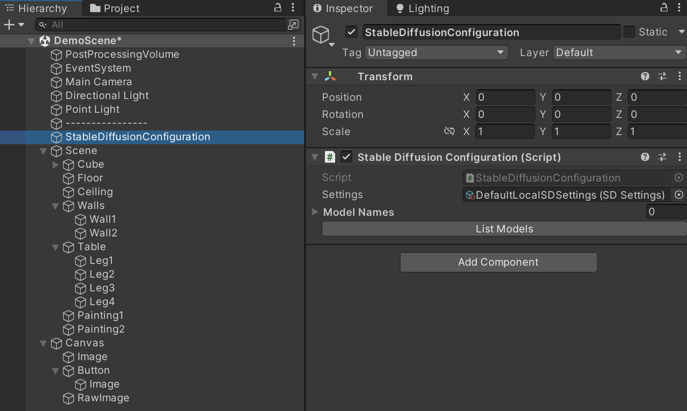
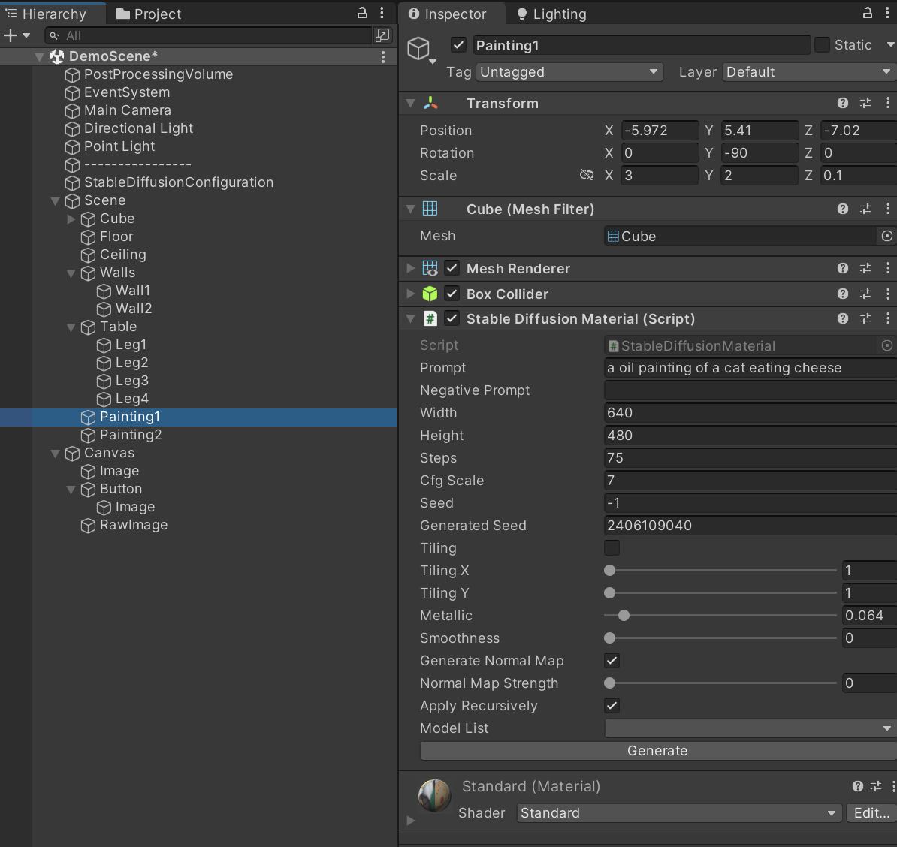
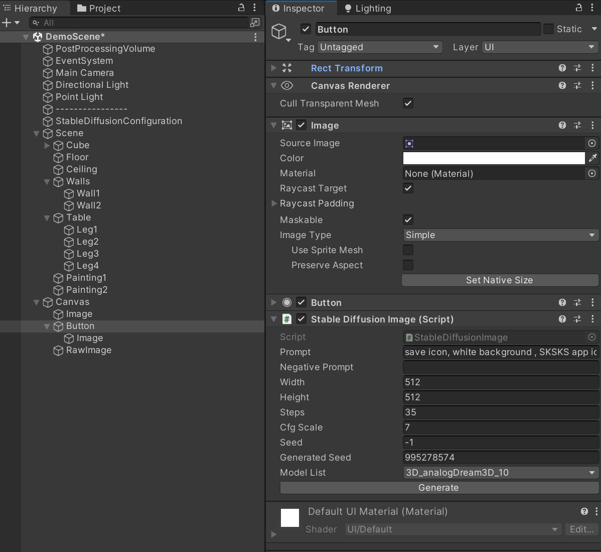
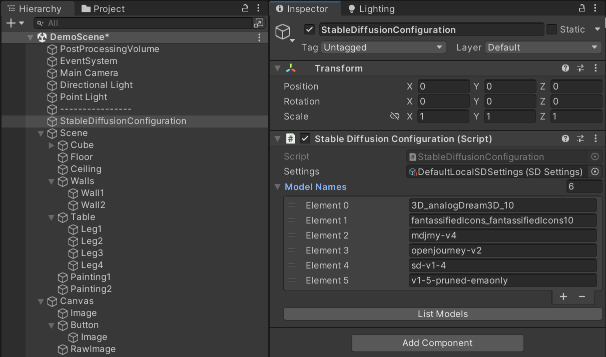

# Stable Diffusion Unity Integration v1.2.5
A basic but functional Unity Editor Component for image generation using Stable Diffusion Automatic 1111 [webui](https://github.com/AUTOMATIC1111/stable-diffusion-webui) from within the Unity Editor.

# Token of Appreciation
If you like it, feel free to Buy me a Coffee (https://www.buymeacoffee.com/dobrado76)

Cheers!

# Overview
Simple server configuration with StableDiffusionConfiguration component and SDSettings ScriptableObject assets.

Easy Text-to-Image generation for 3D models:

Straightforward Text-to-Image generation for UI elements:

# Features
- Text-to-Image generation with Prompt and Negative prompt for:
  a) texturing 3D models having a MeshRenderer component with tiling option and generation of Normal/Bump maps,
  b) UI component having a Image or RawImage component (Canvas, Panel, Image, Button, etc.)
- Image-to-Image generation with Prompt and Negative prompt for:
  a) UI component having a Image or RawImage component (Canvas, Panel, Image, Button, etc.)
- Editor only components for scene/level design (no runtime dependencies to Stable Diffusion)
- Image generation using any Stable Diffusion models available in the server model folder
- Standard parameters control over image generation (Prompt and Negative Prompt, Sampler, Nb. of Steps, CFG Scale, Image dimension and Seed)
- All images saved in the Assets folder for persistent storage and reference

# Dependencies and requirements
This Unity Editor tool requires access to a Stable Diffusion Automatic 1111 server. Installation or usage of such server is outside the scope of this documentation. 
Please refer to the SD A111 WebUI repo: https://github.com/AUTOMATIC1111/stable-diffusion-webui

# Getting Started
1. Install [Stable Diffusion WebUI Automatic 1111](https://github.com/AUTOMATIC1111/stable-diffusion-webui).
2. Launch [Stable DIffusion WebUI Automatic 1111](https://github.com/AUTOMATIC1111/stable-diffusion-webui/wiki/API) with the '--api' argument in the command line define in the "webui-user.bat" command file, in the root folder of your SD server.
Without Authentication:
set COMMANDLINE_ARGS= --api
	; Or with Authentication:	
set COMMANDLINE_ARGS=--listen --api --api-auth YOUR_USERNAME:YOUR_PASSWORD --cors-allow-origins=*

3. Either, Download the stable-diffusion-unity-integration repository, for example by running `git clone https://github.com/dobrado76/Stable-Diffusion-Unity-Integration.git`. Then, Open the stable-diffusion-unity-integration project in Unity.then open the Demo Scene provided in the package found in `StableDiffusionIntegration/Scenes/DemoScene.unity`.

Or;

3. Create and open a new Unity project for Built-in Pipeline, download and import the stable-diffusion-unity-integration.unitypackage file into the project (https://github.com/dobrado76/Stable-Diffusion-Unity-Integration/blob/main/Stable-Diffusion-Unity-Integration.unitypackage). By starting from a new project and importing the package, none of the demo pre-generated images will be available in the Asset folder but the project should work as-is, since the textures and images are embedded in the Unity project.

4. Open the Demo Scene provided in the package found in `StableDiffusionIntegration/Scenes/DemoScene.unity`. There is a version with Post-Processing (you need to install the Post-Processing package, you will need to re-open the scene after installing the package) and a version without Post-Processing.

5. Select the StableDiffusionConfiguration component and make sure the selected setting point to the correct URL and Port (default: http://127.0.0.1:7860/).
6. Click on the `List Model` button to get the list of all available models from your local Stable Diffusion server.

7. Select any existing GameObject with a MeshRenderer (or that contains at least one child with a MeshRenderer) or an Image (or RawImage) and click Generate from the StableDiffusionText2Material, StableDiffusionText2Image or StableDiffusionImage2Image component to generate a new image using the specified parameters. 

8. If any error occured, it should be catched by a try/catch and the exception displayed in the Unity Console.

- The StableDiffusionMaterial component requires to be added to a GameObject that has a MeshRenderer (if apply recursively is not used) or have at least one children GameObject (if apply recursively is used). 
- The StableDiffusionImage component requires to be added to a UI GameObject (in a Canvas hierachy) that has an Image or RawImage component.

# Limitations
Be aware of a few limitations:
- This repo has been testing only in Unity 2019, 2020 and 2021. It may work on other versions but there is no guarantee. 
- The components for generating materials are designed for the Built-in render pipeline and Universal Render Pipeline (URP) only. It may be easy to get it to work for HDRP but no effort has been done in that regard. Feel free to contribute your changes if you make it work.
- Only a local Stable Diffusion server, which requires no API key, was used in testing. This may work with remote servers if they don't require API keys. Feel free to contribute your changes if you get it to work with remote server and API keys.

# Contributing
To contribute, clone the repository, make your changes, commit and push to your clone, and submit a pull request (PR).

Before submitting a PR, make sure that:
- you do not add multiple unrelated things in same PR.
- your changes do not break anything before submitting.
- you do not submit PRs where you just take existing lines and reformat them without changing what they do.

If you think you found a bug, please first make sure that you are using the latest version of both this repo (as well as the Stable Diffusion repo) and that the bug has not already been fixed.
If you are submitting a bug fix, there must be a way for me to reproduce the bug. Please, provide step-by-step instructions on how to reproduce the bug.

# Credits
Thanks to [UnityCoder](https://github.com/unitycoder/NormalMapFromTexture) for a straightforward and functional algorithm to automatically generate a normal map from a texture. - https://github.com/unitycoder/NormalMapFromTexture
Thanks to ALBRRT and FOXYTOCIN for their contributions.

# Licence
This repository is under Lesser General Public License (LGPL) v2.1, that you can find in the `LICENSE` file (https://github.com/dobrado76/Stable-Diffusion-Unity-Integration/blob/72560920786b909e829b567567699f332256ea19/LICENSE).

Mainly, it allows you to:
- use or distribute any artwork generated using this tool without the need to mention this tool, repo or author.
- use, modify, and distribute this code base and other copyrighted work.
- create derivative works to be distributed under a different license than the original.

Requires that the source code for the derative work be made available to others. This does not introduce any limitations on your own Unity projects, since this tool is a Design time, Editor only tool (your game or application is obviously not required to be open source).
Requires that any partial, full or modified distribution of this repo mentions the original source (this repo/author).

# Change Log
2023-03-10: v1.2.5 - Merged Pull Request from FOXYTOCIN to add support for Authentication API keys and URP materials.

2023-02-02: v1.2.4 - Merged Pull Request from ALBRRT to add support for Image-2-Image for UI Image and RawImage. To that effect, renamed StableDiffusionImage to StableDiffusionText2Image and StableDiffusionMaterial to StableDiffusionText2Material, and added a new StableDiffusionImage2Image component.

2023-01-31: v1.2.3 - Merged Pull Request from ALBRRT to fix an issue with progress bar when generating an image with StableDiffusionImage. Not perfect but somewhat/sometimes working ok.

2023-01-31: v1.2.2 - Changed the call to Stable Diffusion server to be asynchronous and non-blocking. Also added a Progress Bar for generation progress feedback.

2023-01-30: v1.2.1 - Added some comments in the code and updated the package with new codebase, to include last merge and post-processing settings for the demo scene with post-processing.

2023-01-25: v1.2.0 - Merged Pull Request from ALBRRT to enable Editor assets refresh only when not in Play mode, or returning from Play mode. Also added the display of the GUID for easier reference between the Component and the Image file.

2023-01-24: v1.1.0 - Added handling of the samplers as generation parameter. Manual list in StableDiffusionConfiguration that can be culled to remove samplers that you don't use.

2023-01-23: v1.0.0 - Initial public distribution version 1.0.0 with brief documentation.
